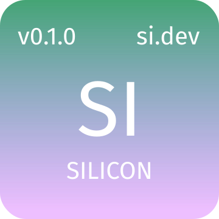

# Sigil

Sigil uses `bun`, `typescript`, `ohm-js` and `binaryen-js`

### Install Dependencies

`bun install`

### Create Typescript Types for Silicon grammar

`bun run build-types`

### Run 

`bun run index.ts`